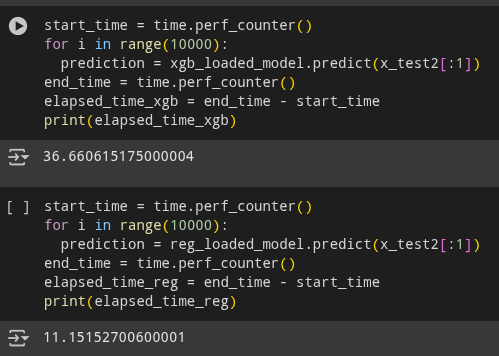

### Part I - Model Selection: Logistic Regression

The Logistic Regression model trained with the top 10 features and class balancing was selected for its efficiency. Compared to XGBoost, it offers a **3x speed improvement** in prediction time and produces a model file that is **200x smaller**.

These performance metrics are illustrated below:

The results from the model's unit tests (`make model-test`) are shown below:

---

### Part II - API Endpoints

Two versions of the prediction endpoint were implemented:

1.  **`predict`**: Adheres to the original project template.
2.  **`predict2`**: Integrates `Pydantic` for robust data validation.

This dual implementation was done because the original template's function signature did not accept arguments, preventing a direct integration with `Pydantic`. Both endpoints are located in the same source file and have passed all API tests.

The results of the `make api-test` command are shown below:

---

### Part III - Deployment on Google Cloud Platform

I leveraged Google Cloud Platform (GCP) for deployment. Specifically, the application was deployed to **Cloud Run**, a serverless platform chosen for its automatic scalability. Furthermore, the model file was saved in ***Google Cloud Storage***.

Below are the results from the `make stress-test` command:

---

### Part IV -Continuous Integration & Continuous Deployment (CI/CD)

The project is configured with CI/CD pipelines using GitHub Actions to automate testing and deployment.

**Continuous Integration (CI) Workflow:**

**Continuous Deployment (CD) Workflow:**

